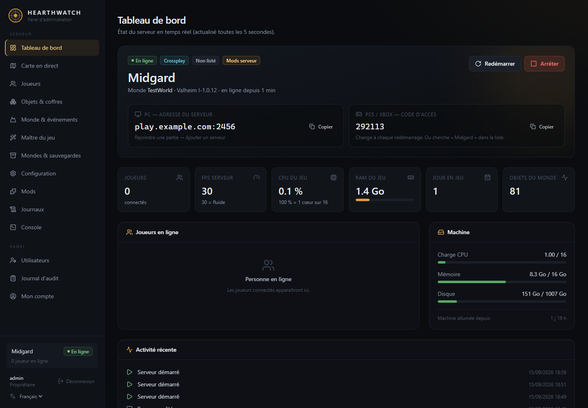
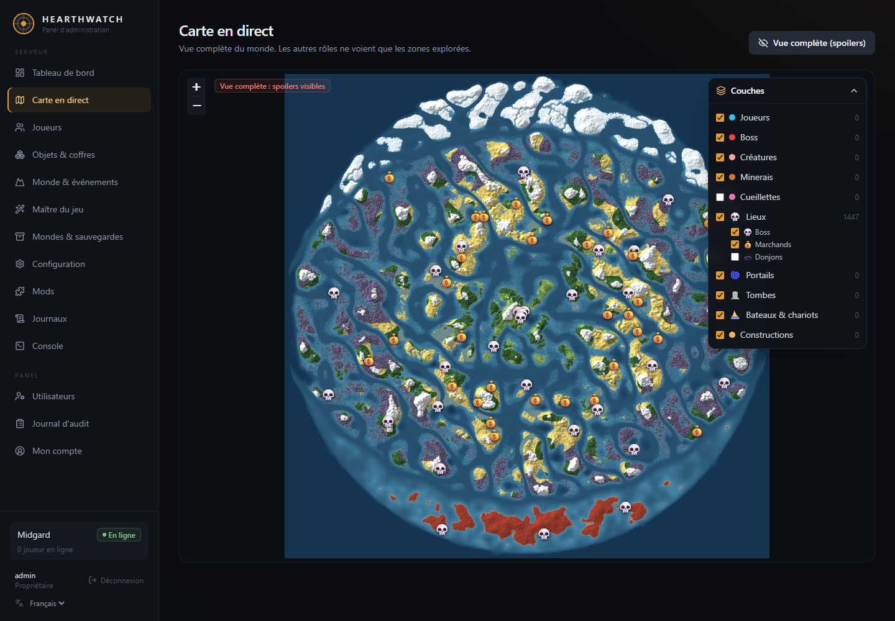
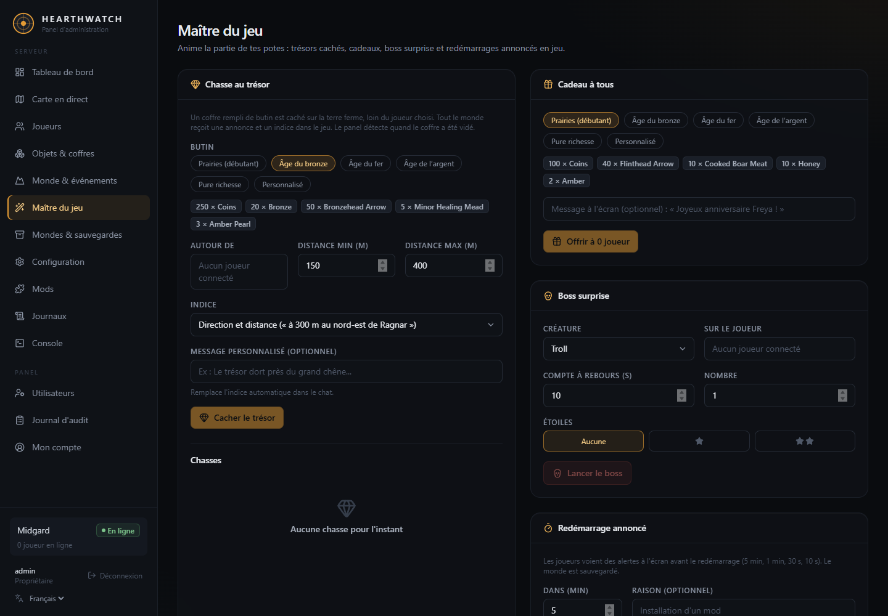
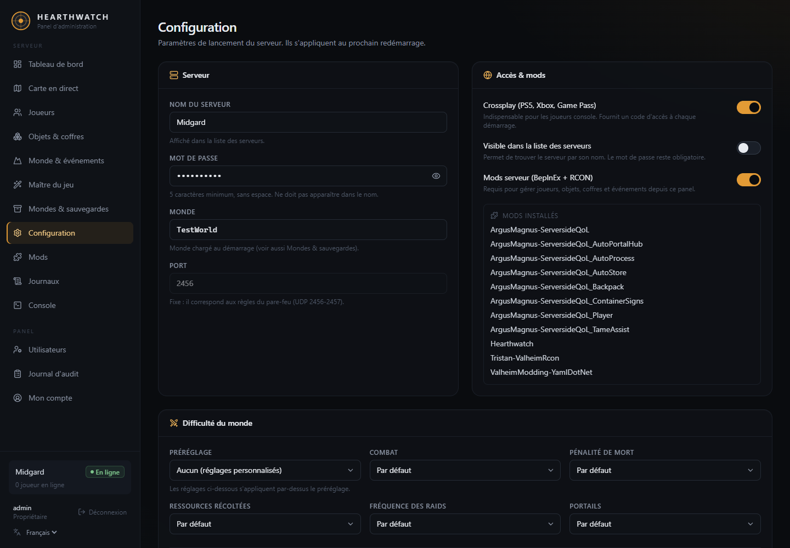
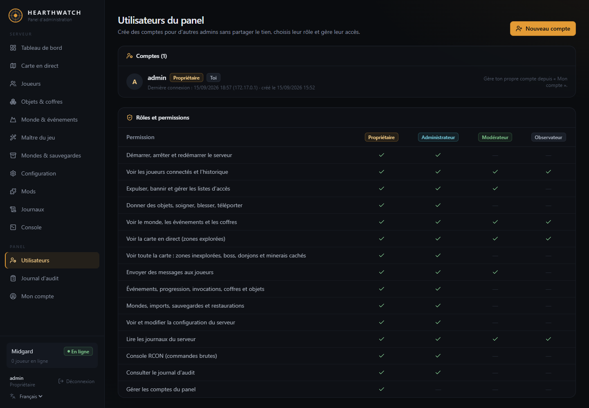

# Hearthwatch

**Panel web auto-hébergé et carte en direct pour serveurs dédiés Valheim.**
Compatible crossplay : tout tourne côté serveur, les joueurs sur PC, PlayStation, Xbox et Switch n'installent rien.

[English](README.md) · [Démarrage rapide](#démarrage-rapide) · [Fonctionnalités](#fonctionnalités) · [Fonctionnement](#fonctionnement) · [FAQ](#faq)

> Hearthwatch est un projet communautaire, sans lien avec Iron Gate AB ni Coffee Stain.



| Carte en direct | Maître du jeu |
| --- | --- |
|  |  |
| **Configuration** | **Utilisateurs du panel** |
|  |  |

---

## Fonctionnalités

- **Tableau de bord** : état du serveur, joueurs connectés, FPS, CPU et RAM, code d'accès crossplay, démarrer / arrêter / redémarrer en un clic (avec mise à jour de Valheim).
- **Carte en direct** : la vraie carte de ton monde générée depuis la graine, avec joueurs, créatures, boss, minerais, portails, tombes, bateaux et constructions en temps réel. **Anti-spoiler** : les comptes classiques ne voient que les zones déjà explorées.
- **Joueurs** : donner des objets, soigner, téléporter, expulser, bannir, gérer admins et liste blanche, historique des connexions.
- **Objets & coffres** : catalogue d'objets, ouvrir n'importe quel coffre pour ajouter ou retirer des objets.
- **Monde & événements** : raids, progression des boss, invocation de créatures, messages en jeu, recherche et suppression d'objets du monde.
- **Maître du jeu** : chasses au trésor avec indices en jeu, cadeaux pour tous, boss surprise avec compte à rebours, redémarrages annoncés.
- **Arène** : une arène en pierre construite dans ton monde par le serveur. Entre dans le cercle et affronte des vagues adaptées à l'équipement et à la progression de l'équipe, des Prairies au Nord profond, avec récompenses au centre et classement dans le panel. Fonctionne aussi pour les joueurs console.
- **Ville** : génère une cité médiévale entière depuis le panel et visualise-la en 3D avant que le serveur ne la bâtisse : toute la ville repose sur un dallage de pierre continu, rues en planchers avec barrières basses et lampadaires ; remparts de pierre et de bois à chemin de ronde couvert, tours, porteries et douves, grand-place et monument, immense château (salle du trône à colonnes de pierre, grand salon, chambres, réserve, tours accessibles), tous les ateliers d'artisanat et leurs améliorations, entrepôt de la fonderie, Haldor, Hildir et la sorcière des marais au marché couvert, grande brasserie avec bar et cuves de brassage, église en bois debout et son clocher, armurerie-musée exposant chaque arme et chaque armure du jeu par région avec leurs pancartes, arène viking à gradins et quatre portes, et maisons vikings toutes différentes (longères, à étage, en L, en T, en U, rondes, balcons, jardins, dix styles d'intérieur). Les nouveaux joueurs y apparaissent. Murs et toits sont tenus par le serveur : ils ne s'usent pas, ne s'effondrent pas et ne se cassent pas ; les pièces disparues sont remises en place automatiquement.
- **Monde vivant** : trente habitants vivent dans la ville — un métier, un logis, une routine quotidienne, des besoins, des humeurs, des souvenirs, une opinion sur chaque joueur et des ragots qu'ils se transmettent. Les joueurs leur parlent dans le chat du jeu et ils répondent à voix haute dans des bulles : une IA joue le personnage (un modèle Ollama local, une API compatible OpenAI, ou Claude), tandis que les quêtes, les prix et les récompenses restent entre les mains du serveur. Contrats du jour, coffres de remise, saga en neuf chapitres, économie vivante avec ses pénuries, crieur public, sermons de l'aube, chansons du barde, lutrin à pétitions et chronique écrite de ce que font les joueurs. Sans IA, tout fonctionne encore, avec des répliques écrites.
- **Portail des joueurs** : le joueur tape `!portail` en jeu, reçoit un code et ouvre le portail sur son téléphone : feuille de personnage, renommée et titres, contrats et leur avancement, saga, nouvelles de la cité, classement et annuaire des habitants — avec qui il peut converser même hors du jeu. Avec le service vocal facultatif, chaque habitant parle de sa propre voix et le joueur peut répondre en parlant.
- **Mondes & sauvegardes** : créer, changer, importer ton monde solo, télécharger, archives nocturnes et restauration en un clic.
- **Configuration** : nom, mot de passe, crossplay, préréglages de difficulté et modificateurs du monde.
- **Mods côté serveur** : BepInEx, ValheimRcon et les modules optionnels [ServersideQoL](https://thunderstore.io/c/valheim/p/ArgusMagnus/ServersideQoL/), avec un éditeur de réglages dans le panel.
- **Accès en équipe** : plusieurs comptes avec rôles (propriétaire, administrateur, modérateur, observateur) et journal d'audit de chaque action.
- **Journaux et console RCON**, sauvegardes quotidiennes et redémarrages de mise à jour (reportés si des joueurs sont connectés).

## Démarrage rapide

Sur un serveur Linux (x86_64) avec Docker :

```bash
curl -fsSL https://raw.githubusercontent.com/Spokator/hearthwatch/main/install.sh | bash
```

L'installateur pose quelques questions (nom du serveur, mot de passe, crossplay, domaine facultatif), démarre tout et affiche l'adresse du panel et le premier mot de passe administrateur.

**Prérequis**
- Linux x86_64 avec Docker Engine et Docker Compose v2 (l'installateur peut installer Docker)
- 4 Go de RAM minimum (Valheim en utilise 2 à 3 Go), 10 Go de disque
- Ports ouverts : `2456-2457/udp` pour le jeu, `8080/tcp` pour le panel (ou `80`/`443` avec un domaine)

Le premier démarrage télécharge Valheim (environ 2 Go) : compte quelques minutes avant que les joueurs puissent rejoindre.

### Installation manuelle

```bash
mkdir hearthwatch && cd hearthwatch
curl -fsSLO https://raw.githubusercontent.com/Spokator/hearthwatch/main/docker-compose.yml
curl -fsSL https://raw.githubusercontent.com/Spokator/hearthwatch/main/.env.example -o .env
nano .env                       # au minimum SERVER_NAME et PUBLIC_ADDRESS, HW_LANGUAGE=fr
docker compose up -d
docker compose logs hearthwatch | grep password
```

Avec un domaine qui pointe vers ton serveur, renseigne `DOMAIN` dans `.env` et lance `docker compose --profile https up -d` pour un HTTPS automatique.

## Configuration

`.env` contient les valeurs de départ ; une fois le serveur créé, les réglages du jeu se modifient depuis le panel.

| Variable | Défaut | Description |
| --- | --- | --- |
| `SERVER_NAME` | `My Valheim Server` | Nom dans la liste des serveurs |
| `SERVER_PASSWORD` | généré | 5 caractères min., absent du nom |
| `WORLD_NAME` | `Dedicated` | Monde chargé au démarrage |
| `SERVER_PUBLIC` | `0` | `1` pour lister le serveur dans le jeu |
| `SERVER_CROSSPLAY` | `1` | `1` pour les joueurs PlayStation, Xbox, Switch et Game Pass |
| `SERVERSIDE_QOL` | `1` | Installer les modules ServersideQoL |
| `PANEL_PORT` / `PANEL_BIND` | `8080` / `0.0.0.0` | Port et adresse d'écoute du panel |
| `PUBLIC_ADDRESS` | | IP ou domaine affiché aux joueurs PC |
| `DOMAIN` | | Active le HTTPS avec le profil `https` |
| `HW_LANGUAGE` | `en` | `en` ou `fr` |
| `TZ` | `Etc/UTC` | Fuseau horaire des tâches quotidiennes |
| `BACKUP_HOUR` / `RESTART_HOUR` | `4` / `5` | Archive quotidienne et redémarrage de mise à jour, `-1` pour désactiver |

## Fonctionnement

```
┌──────────────── conteneur hearthwatch ──────────────┐
│ supervisord                                         │
│ ├─ Serveur dédié Valheim (SteamCMD, dans /data)     │
│ │   └─ BepInEx                                      │
│ │       ├─ ValheimRcon       → RCON local (2458)    │
│ │       ├─ HearthwatchBridge → exports carte/monde  │
│ │       └─ ServersideQoL (optionnel)                │
│ └─ Panel (Node.js) ── RCON, exports, fichiers config│
└───────────────── volume /data ──────────────────────┘
```

- Le jeu, SteamCMD et les mods sont téléchargés au démarrage dans le volume `/data` : l'image ne contient aucun fichier propriétaire.
- `plugin/HearthwatchBridge` est un petit plugin BepInEx côté serveur qui génère la carte depuis la graine et exporte les données en direct pour le panel.
- Tous les mods sont côté serveur uniquement, ce qui garde le serveur accessible depuis les consoles.

## Monde vivant

La ville n'est pas un décor : ses habitants ont un emploi du temps, une humeur et une mémoire.

- **Routines** : chacun travaille, mange, boit un verre à la brasserie, prie, flâne et dort à ses heures ; jours sacrés, jours de marché et fêtes de l'hydromel changent la journée de toute la cité.
- **Têtes** : cinq traits de caractère, des besoins (repos, faim, compagnie), huit émotions qui retombent avec le temps, des souvenirs classés par importance, une opinion sur chaque joueur, et des rumeurs qui passent d'un habitant à l'autre.
- **Parler** : dites un prénom dans le chat, ou approchez-vous simplement. La mécanique est décidée par le serveur (contrats, prix, livraisons, récompenses) et l'IA ne fait que donner sa voix au personnage, avec son humeur et ses secrets. Commandes : `!aide`, `!journal`, `!saga`, `!contrats`, `!accepter N`, `!rendre`, `!prix`, `!acheter N objet`, `!vendre`, `!renommee`, `!qui`, `!rumeurs`, `!heure`, `!amende`, `!portail`.
- **Livraisons** : chaque artisan a son coffre de remise devant lui. Déposez la marchandise, dites que c'est fait, et le serveur prend exactement ce que demande le contrat et vous paie.
- **Saga** : neuf chapitres qui suivent la progression du jeu, du premier serment au sort de l'Empereur, avec des événements qui changent la cité pour de bon.
- **Vie de la cité** : raids nocturnes où la garde se masse à la porte menacée et où les défenseurs se partagent la récompense, caravanes de marchands qui remplissent les étals et adoucissent les prix, fêtes de l'hydromel, primes de chasse, tournois d'arène et cartes au trésor — le coffre est vraiment là, sur la terre ferme, à l'endroit annoncé.
- **Grands chantiers** : des buts communs payés en matériaux déposés dans le coffre du chantier (la cloche, le guet, la mine, la statue de l'Empereur). Chacun change la cité pour de bon, et tous ceux qui ont donné touchent leur part à l'achèvement.
- **Faveurs personnelles** : gagnez l'amitié d'un habitant et il vous demandera ce qu'il ne demanderait à personne d'autre — puis vous confiera son secret.

### Où se calcule le dialogue

Ollama sur le serveur est le plus simple, mais un petit modèle sur processeur demande 15 à 25 secondes par réplique. Deux voies plus rapides, à choisir dans le panel :

- **Un PC de la maison avec une carte graphique** (fournisseur « renfort ») : lancez `panel/deploy/ai-worker` sur ce PC. Il appelle le panel, prend le travail de dialogue, le calcule chez lui et renvoie la réplique — une à deux secondes, et rien à ouvrir sur la box. Quand le PC est éteint, le serveur retombe tout seul sur son propre modèle.
- **N'importe quelle API en ligne** (compatible OpenAI, ou Claude) : la clé se colle dans le panel.

Un fournisseur de secours peut être réglé dans tous les cas : les habitants ne restent jamais muets.

### Voix (facultatif)

La parole et la dictée tournent sur votre propre serveur, sans compte ni nuage :

```bash
sudo bash panel/deploy/install-voice.sh          # Piper (parole) + faster-whisper (dictée)
```

Le script installe un petit service sur `127.0.0.1:4032`, donne à chaque habitant une voix distincte (choisie selon son genre, son âge et la hauteur de voix) et affiche les deux lignes à ajouter dans `panel.env`. Les répliques sont gardées en MP3 : une phrase déjà dite ne coûte plus rien. Comptez environ 1,5 Go de disque et 700 Mo de mémoire pendant une transcription ; une réplique demande une à deux secondes de synthèse sur un simple processeur.

## Au quotidien

```bash
docker compose logs -f                              # suivre les journaux
docker compose pull && docker compose up -d         # mettre à jour Hearthwatch
docker compose down                                 # arrêter (le monde est sauvegardé)
docker exec -it hearthwatch node /opt/hearthwatch/panel/server/set-password.js admin   # réinitialiser le mot de passe propriétaire
```

Les sauvegardes sont dans le volume `hearthwatch-data`, sous `/data/backups`, et se téléchargent depuis le panel.

## FAQ

**Les joueurs PlayStation ou Xbox peuvent-ils utiliser des mods ?** Non, les consoles ne gèrent pas les mods. Hearthwatch n'utilise que des mods côté serveur, donc les joueurs console peuvent rejoindre avec le crossplay.

**Comment les joueurs console rejoignent-ils ?** Avec le code d'accès affiché sur le tableau de bord (il change à chaque redémarrage), ou en cherchant le nom du serveur s'il est listé.

**La carte gâche-t-elle la découverte ?** Seuls les propriétaires et administrateurs voient toute la carte. Les autres rôles ne reçoivent que les zones explorées : le serveur filtre l'image et les données.

**Peut-on l'utiliser sans Docker ?** Oui, voir [panel/README.md](panel/README.md) pour une installation systemd. Docker reste la méthode recommandée.

## Crédits

- [ValheimRcon](https://github.com/Tristan-dvr/ValheimRcon) par Tristan, [ServersideQoL](https://github.com/ArgusMagnus/ValheimServersideQoL) par ArgusMagnus, [BepInEx](https://github.com/BepInEx/BepInEx)
- Catalogue d'objets et de créatures construit depuis la [liste des prefabs de Jötunn](https://valheim-modding.github.io/Jotunn/data/prefabs/prefab-list.html)
- [Leaflet](https://leafletjs.com), [Fastify](https://fastify.dev), [React](https://react.dev), [Tailwind CSS](https://tailwindcss.com), [Lucide](https://lucide.dev)

## Licence

[MIT](LICENSE)
