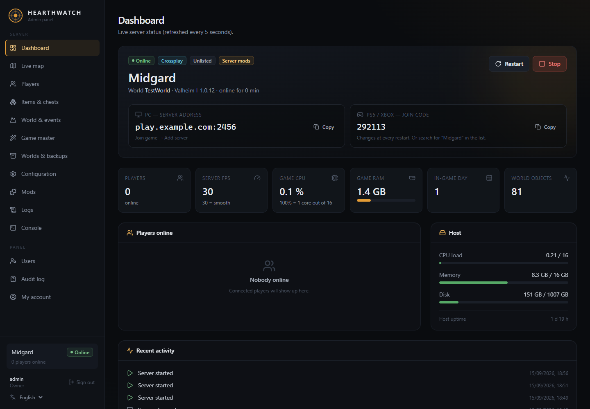
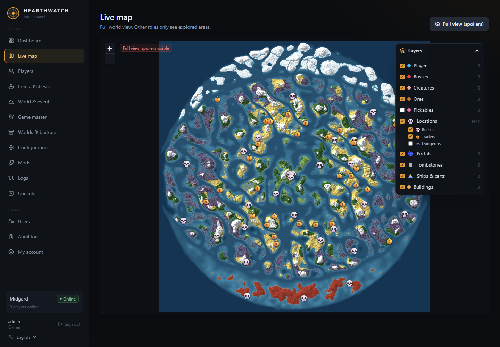
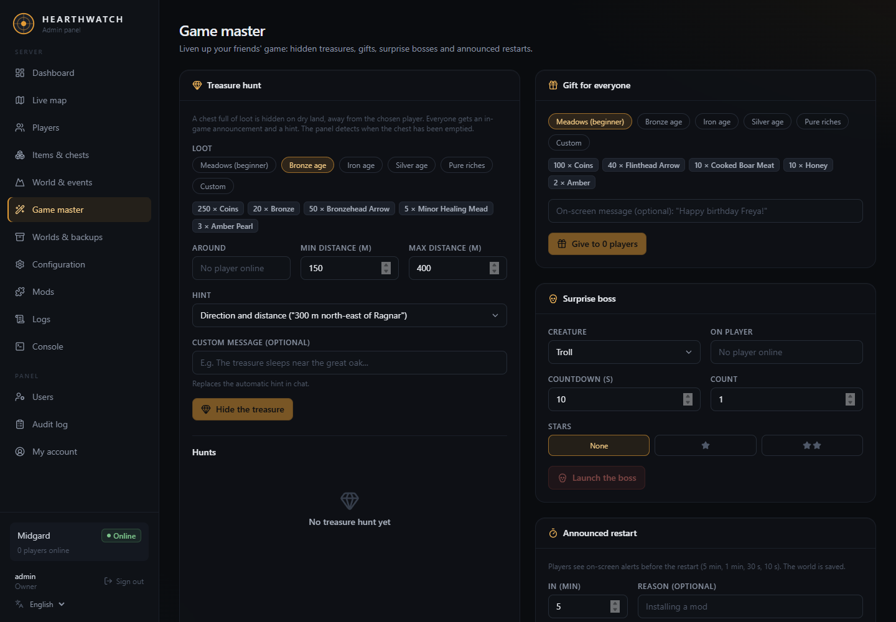
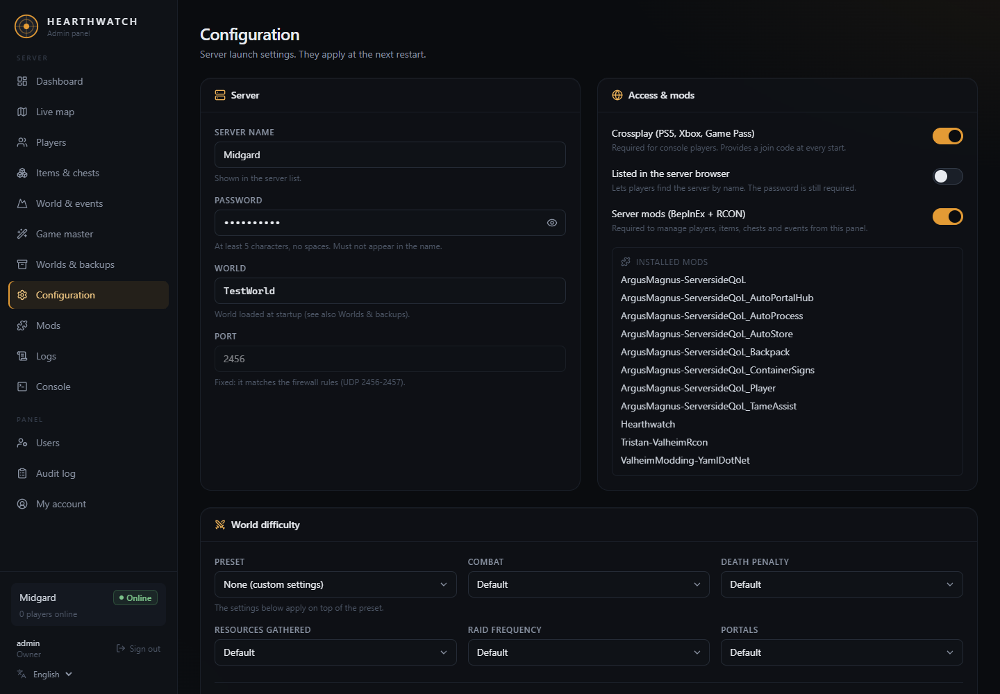
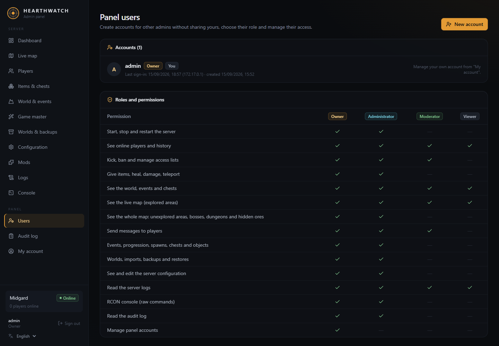

# Hearthwatch

**Self-hosted web panel and live map for Valheim dedicated servers.**
Crossplay friendly: everything runs on the server, so players on PC, PlayStation, Xbox and Switch install nothing.

[Français](README.fr.md) · [Quick start](#quick-start) · [Features](#features) · [How it works](#how-it-works) · [FAQ](#faq)

> Hearthwatch is a community project. It is not affiliated with or endorsed by Iron Gate AB or Coffee Stain.



| Live map | Game master |
| --- | --- |
|  |  |
| **Configuration** | **Panel users** |
|  |  |

---

## Features

- **Dashboard**: server state, players online, FPS, CPU and RAM, crossplay join code, one-click start / stop / restart (updates Valheim).
- **Live map**: the real world map generated from your seed, with players, creatures, bosses, ores, portals, tombstones, ships and buildings in real time. **Anti-spoiler**: regular accounts only see the areas already explored.
- **Players**: give items, heal, teleport, kick, ban, admin and whitelist management, connection history.
- **Items & chests**: searchable item catalog, open any chest and add or remove items.
- **World & events**: raids, boss progression keys, spawn creatures, in-game messages, find and delete world objects.
- **Game master**: hidden treasure hunts with in-game hints, gifts for everyone, surprise bosses with a countdown, announced restarts.
- **Arena**: a stone arena built into your world by the server. Step into the circle and fight waves scaled to your team's gear and progression, from Meadows to the Deep North, with rewards dropped at the centre and a leaderboard in the panel. Works for console players too.
- **City**: generate a whole medieval city from the panel and preview it in 3D before the server builds it: the whole city stands on a continuous stone pavement with plank streets, low fences and lamp posts; timber-and-stone ramparts with a covered wall walk, towers, gatehouses and a moat, main square and monument, a huge castle (throne room with stone columns, great hall, bedrooms, storeroom, climbable towers), every crafting station with its upgrades, a foundry warehouse, Haldor, Hildir and the Bog Witch in a covered market, a great mead hall with its bar and brewery, a stave church with its bell tower, a museum-like armory showing every weapon and armor set of the game by region with name plates, a Viking arena with stands and four gates, and Viking houses that are all different (longhouses, two storeys, L, T and U shapes, round houses, balconies, gardens, ten interior styles). New players spawn there. Walls and roofs are held by the server, so they never wear out, collapse or get destroyed; missing pieces are put back automatically.
- **Living world**: thirty inhabitants live in the city — a trade, a home, a daily routine, needs, moods, memories, opinions about each player, and gossip they pass around. Players talk to them in the game chat and they answer out loud in speech bubbles: an AI plays the character (a local Ollama model, any OpenAI-compatible API, or Claude), while quests, prices and rewards stay in the server's hands. Daily contracts, delivery chests, a nine-chapter saga, a living economy with shortages, a town crier, dawn sermons, bard songs, a petition lectern and a written chronicle of what players do. Without AI everything still works, with written lines.
- **Player portal**: players type `!portal` in game, get a code and open the portal on their phone: character sheet, renown and titles, contracts with their progress, the saga, city news, the leaderboard and a directory of the inhabitants — including conversations with them from outside the game. With the optional voice service, each inhabitant speaks with their own voice and players can answer by talking.
- **Worlds & backups**: create, switch, import your single-player world, download, nightly archives and one-click restore.
- **Configuration**: server name, password, crossplay, difficulty presets and world modifiers.
- **Server-side mods**: BepInEx, ValheimRcon and optional [ServersideQoL](https://thunderstore.io/c/valheim/p/ArgusMagnus/ServersideQoL/) modules, with a settings editor in the panel.
- **Team access**: multiple panel accounts with roles (owner, admin, moderator, viewer) and an audit log of every action.
- **Logs and RCON console**, daily backups and update restarts (skipped while players are online).

## Quick start

On a Linux server (x86_64) with Docker:

```bash
curl -fsSL https://raw.githubusercontent.com/Spokator/hearthwatch/main/install.sh | bash
```

The installer asks a few questions (server name, password, crossplay, optional domain), starts everything and prints the panel address and the first admin password.

**Requirements**
- Linux x86_64 with Docker Engine and Docker Compose v2 (the installer can install Docker for you)
- 4 GB of RAM minimum (Valheim uses 2 to 3 GB), 10 GB of disk
- Open ports: `2456-2457/udp` for the game, `8080/tcp` for the panel (or `80`/`443` with a domain)

The first start downloads Valheim (about 2 GB): allow a few minutes before players can join.

### Manual install

```bash
mkdir hearthwatch && cd hearthwatch
curl -fsSLO https://raw.githubusercontent.com/Spokator/hearthwatch/main/docker-compose.yml
curl -fsSL https://raw.githubusercontent.com/Spokator/hearthwatch/main/.env.example -o .env
nano .env                       # set at least SERVER_NAME and PUBLIC_ADDRESS
docker compose up -d
docker compose logs hearthwatch | grep password
```

With a domain pointing to your server, set `DOMAIN` in `.env` and use `docker compose --profile https up -d` for automatic HTTPS.

## Configuration

`.env` holds the initial values; once the server exists, change game settings from the panel.

| Variable | Default | Description |
| --- | --- | --- |
| `SERVER_NAME` | `My Valheim Server` | Name in the server list |
| `SERVER_PASSWORD` | generated | 5+ characters, must not appear in the name |
| `WORLD_NAME` | `Dedicated` | World loaded at start |
| `SERVER_PUBLIC` | `0` | `1` to list the server in the in-game browser |
| `SERVER_CROSSPLAY` | `1` | `1` for PlayStation, Xbox, Switch and Game Pass players |
| `SERVERSIDE_QOL` | `1` | Install the ServersideQoL modules |
| `PANEL_PORT` / `PANEL_BIND` | `8080` / `0.0.0.0` | Panel port and listening address |
| `PUBLIC_ADDRESS` | | IP or domain shown to PC players |
| `DOMAIN` | | Enables HTTPS with the `https` profile |
| `HW_LANGUAGE` | `en` | `en` or `fr` |
| `TZ` | `Etc/UTC` | Time zone for daily tasks |
| `BACKUP_HOUR` / `RESTART_HOUR` | `4` / `5` | Daily archive and update restart, `-1` to disable |

## How it works

```
┌────────────── hearthwatch container ───────────────┐
│ supervisord                                        │
│ ├─ Valheim dedicated server (SteamCMD, in /data)   │
│ │   └─ BepInEx                                     │
│ │       ├─ ValheimRcon      → local RCON (2458)    │
│ │       ├─ HearthwatchBridge → map & world exports │
│ │       └─ ServersideQoL (optional)                │
│ └─ Panel (Node.js) ── RCON, exports, config files  │
└──────────────── volume /data ──────────────────────┘
```

- Game files, SteamCMD and mods are downloaded at runtime into the `/data` volume: the image contains no proprietary files.
- `plugin/HearthwatchBridge` is a small server-side BepInEx plugin that renders the world map from the seed and exports live data for the panel.
- All mods are server-side only, which keeps the server joinable from consoles.

## Living world

The city is not a decor: its people have a schedule, a mood and a memory.

- **Routines**: each inhabitant works, eats, drinks at the mead hall, prays, strolls and sleeps at their own hours; holy days, market days and mead festivals change the whole city's day.
- **Minds**: five personality traits, needs (rest, food, company), eight emotions that fade over time, memories with an importance, an opinion of each player, and rumours that travel from one inhabitant to another.
- **Talking**: say a name in the chat, or simply walk up to someone. Mechanics are decided by the server (contracts, prices, deliveries, rewards) and the AI only gives the character their voice, in their mood, with their secrets. Chat commands: `!help`, `!journal`, `!saga`, `!work`, `!accept N`, `!turnin`, `!prices`, `!buy N item`, `!sell`, `!renown`, `!who`, `!rumours`, `!time`, `!fine`, `!portal`.
- **Deliveries**: every craftsman has a delivery chest in front of them. Drop the goods in, say you are done, and the server takes exactly what the contract asks for and pays you.
- **Saga**: nine chapters that follow the game's own progression, from the first oath to the Emperor's fate, with events that change the city for good.

### Voices (optional)

Speech and dictation run on your own server, with no account and no cloud:

```bash
sudo bash panel/deploy/install-voice.sh          # Piper (speech) + faster-whisper (dictation)
```

It installs a small service on `127.0.0.1:4032`, gives each inhabitant a distinct voice (chosen by gender, age and pitch), and prints the two lines to add to `panel.env`. Replies are cached as MP3, so a line already said costs nothing. Count about 1.5 GB of disk and 700 MB of memory while transcribing; a reply takes one to two seconds to synthesise on a plain CPU.

## Everyday tasks

```bash
docker compose logs -f                              # follow logs
docker compose pull && docker compose up -d         # update Hearthwatch
docker compose down                                 # stop (the world is saved)
docker exec -it hearthwatch node /opt/hearthwatch/panel/server/set-password.js admin   # reset the owner password
```

Backups live in the `hearthwatch-data` volume under `/data/backups` and can be downloaded from the panel.

## FAQ

**Can PlayStation or Xbox players use mods?** No. Consoles do not support mods. Hearthwatch only uses server-side mods, so console players can join with crossplay enabled.

**How do console players join?** With the join code shown on the dashboard (it changes at every restart), or by searching the server name if it is listed.

**Does the map spoil the world?** Only owners and admins see the full map. Other roles only get explored areas: the server filters the image and the data.

**Can I use it without Docker?** Yes, see [panel/README.md](panel/README.md) for a native systemd setup. Docker is the supported path.

## Credits

- [ValheimRcon](https://github.com/Tristan-dvr/ValheimRcon) by Tristan, [ServersideQoL](https://github.com/ArgusMagnus/ValheimServersideQoL) by ArgusMagnus, [BepInEx](https://github.com/BepInEx/BepInEx)
- Item and creature catalog built from the [Jötunn prefab list](https://valheim-modding.github.io/Jotunn/data/prefabs/prefab-list.html)
- [Leaflet](https://leafletjs.com), [Fastify](https://fastify.dev), [React](https://react.dev), [Tailwind CSS](https://tailwindcss.com), [Lucide](https://lucide.dev)

## License

[MIT](LICENSE)
